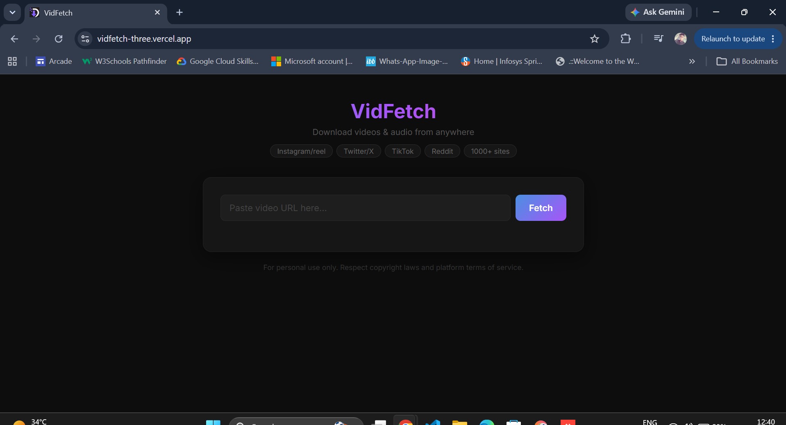
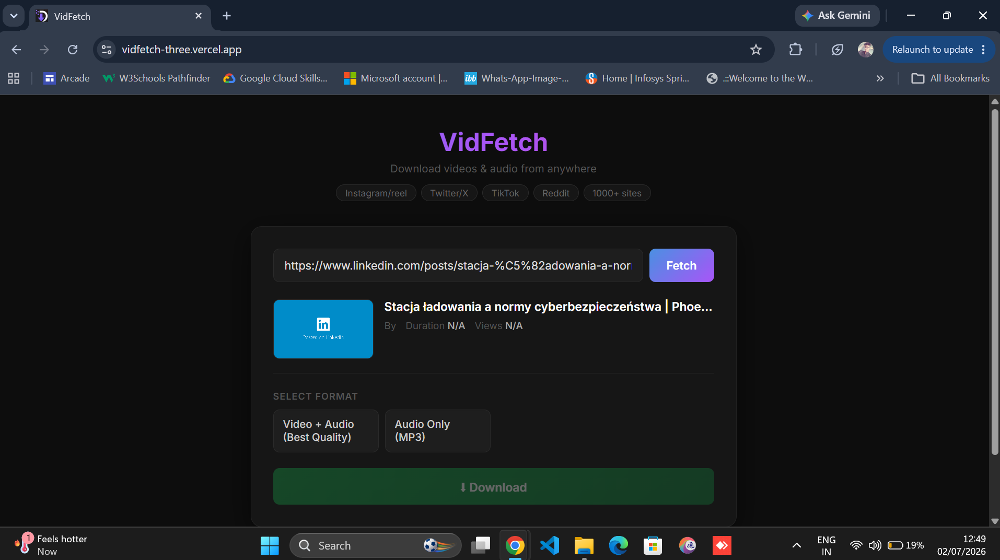
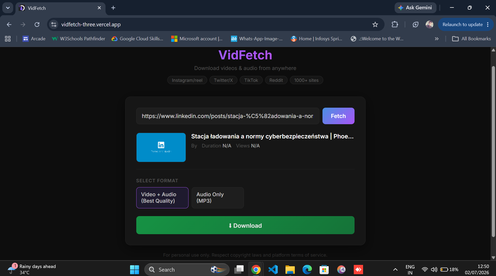

# 🚀 VidFetch

VidFetch is a full-stack video downloader web application built with HTML, CSS, JavaScript, Python (Flask), and yt-dlp. It allows users to fetch video information and download videos or audio from 1000+ supported websites through a clean and responsive interface.

🌐 **Live Demo:** https://vidfetch-three.vercel.app

---

## ✨ Features

- 📥 Download videos in high quality
- 🎵 Download audio in MP3 format
- 📹 Fetch video title, thumbnail, duration, and uploader
- 🌍 Supports 1000+ websites through yt-dlp
- ⚡ Fast and responsive user interface
- 🔄 Automatic file cleanup on the server

- ## 🛠 Tech Stack

### Frontend
- HTML5
- CSS3
- JavaScript

### Backend
- Python
- Flask

### Libraries & Tools
- yt-dlp
- FFmpeg
- Flask-CORS

### Deployment
- Vercel (Frontend)
- Render (Backend)
## 📷 Screenshots

### 🏠 Home Page

### 🎬 Video Information

### ⬇ Download

